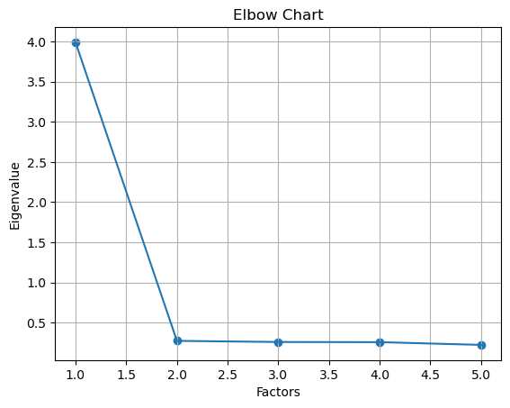
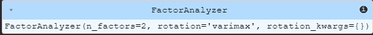
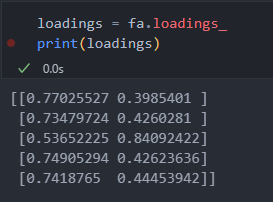

# Purchasing_latent_factors
Using factor analysis to identify latent factors in purchasing decisions.

##### Factor analysis assumes that the predictor variables are correlated.

### Statistics Tests
- Bartlett
- KMO
  
### Elbow Chart

### FactorAnalyzer

### Results

**Interpretation:**

Factor 1 (F1): This factor has strong factor loadings for **purchase_frequency**, **average_value**, **store_time** and **app_use**, which suggests that this factor may be related to "general customer engagement" or "intensity of the customer's relationship with the store". It may represent customers who not only buy frequently, but also spend more time in the store, spend the same amount on average and use the app frequently.

Factor 2 (F2): This factor has a very strong factor loading for **most_purchased_category**, suggesting that it may be related to "customer loyalty to a type of product or brand". It may represent customers who seek out a specific product or brand and do not focus solely on the value of the product.
